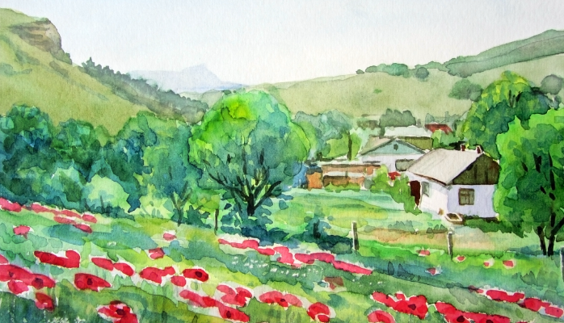

# This One Simple Question Will Reveal What Kind Of Developer You Are

## I must’ve asked this question a thousand times. Maybe more.

I’ve asked this question in interviews. I’ve asked it at the office. I’ve asked and asked and asked.

>>Is software development more like building a bridge or more like painting a painting?

Every single time the answer I get from software professionals is that software development is more like building a bridge than painting a painting. I’ve had some people, the crazy ones, say that it’s 50–50. But I can’t think of anyone siding with the painting more than with the bridge.

Call me crazy. It’s ok, you’ll be in great company. Most of my friends already do call me crazy. But, no really, call me crazy but I believe software development is more like painting than it is like building a bridge. A lot more like painting. A lot as in 80%-90%.

What I mean by that is that software development is more art than science. A lot more art. Mainly art. We speak of computer science but what we rarely speak of is computer art. Or better yet, the art of software development. I wish we spoke more often about the art of software development. So here goes nothing.

## Creative Artists Make Better Software Developers

First off, don’t get me wrong, I do think a certain amount of science is required in order to build great software products. But, having said that, I’ll take an artist with fresh programming skills over an experienced programmer with absolutely no artistic talent whatsoever, anytime.

Now, when I say artist, I don’t necessarily mean the type of person that can draw you a portrait but I mean artist in the sense that they put creativity first in their work, before anything else. I mean someone who doesn’t feel comfortable in a given box of constraints and who crawls their way out of that box, mentally and emotionally, only to explore the world that exists beyond the box. And in that new, limitless world, where raw inspiration and ideas flow freely, the artist can then grab ahold of those immaterial ideas and thoughts, put them together in an orderly graph that can be surfed and processed and enjoyed by others with ease. And with a sense of wonder.

## Here’s A Story.

That Is Probably Playing At An Office Near You. Right Now.

Once upon a time there was a manager, let’s call her Sarah, who had two software developers in her team. The first software developer, let’s call him Mike, was a senior developer with a decade-long experience in building software products. The second developer, let’s call him Andy was fresh out of university, with virtually no professional work experience. This was Andy’s first real job out of university. Needless to say, Andy was paid half of what Mike was making.

One day, Sarah approached Mike with a request for a new feature in their flagship product, a mobile chat app. Sarah asked Mike to add a side menu to the entire application and a top left menu button that would toggle the side menu on and off. The menu was to hold a sign up form and a sign up call-to-action button that would be presented to users when they would tap the top left menu button. Once a user would fill up the form and sign up, they would be presented with a premium offer.

Sarah asked Mike to estimate the engineering effort in building this new feature. Mike took his sweet time and eventually came up with a serious estimate of two weeks worth of engineering time. He had broken up his tasks like a good software developer and estimated each one separately. Being the high-paid professional that he is, Mike is known for his estimation accuracy so Sarah felt confident that if she were to give Mike the green light to implement the feature, he would really finish it in a couple of weeks.

On her way to her boss, Mr. Grumpy, ready to present her product roadmap, Sarah bumped into Andy who was sitting on a couch. Doing nothing.

“Hey Andy”, she said. “What are you doing?”

To which of course Andy replied that he is doing nothing.

“C’mon, you can’t seriously be doing nothing. And besides, I’m not paying you to do nothing. You have to be doing something.”

Andy, who was deeply engrossed in doing nothing, snaps back to reality and apologises and offers to be of help with whatever his dear boss would require of him to do.

“Here”, says Sarah, “take a look at this feature request. How long would it take you to build this?”

Andy looks at the notes on Sarah’s tablet and then lounges back on the couch looking at the ceiling.

“What are you doing, Andy? How long would it take you to build this feature?”

Andy looks back at Sarah and simply utters one single word: “Why?”

Sarah: “Why what?”

Andy: “Why do you need this side menu?”

Sarah: “So I can ask people to sign up”

“I see” says Andy as he goes back to doing nothing.

Sarah just gets fed up with young inexperienced Andy and she motions to leave.

“Wait”, utters Andy. “You already have a tab bar at the bottom, don’t you?”

Sarah: “Yeah, so?”

Andy: “And it only has four tabs, doesn’t it?”

Sarah: “Ok, what’s your point, Andy?”

Andy: “Well, you could add another tab and call it ‘Premium’”

Sarah: “And?”

Andy: “And that’s all.”

Sarah: “What do you mean that’s all? I want people to sign up”

Andy: “Why?”

Sarah: “Andy, I told you, so that we can present them a premium offer. Oh. I see what you mean. So what you’re saying is that just put a new tab, call it Premium and if people click on it then just show them the premium offer. Which is what we wanted in the first place. Except this way we would get there with one single tap. And less work.”

Andy: “Right.”

Sarah: “Ok well, good job Andy. How long would it take you to build that?”

“20 minutes?” says Andy as he calmly goes back to doing nothing.

Sarah continued her walk to Mr. Grumpy’s office and she did indeed present the new roadmap, except that she presented the one-tap version of the premium offer feature instead of the side menu version. She also shaved off 2 weeks off the delivery time and quite a bit of cash, since not only did Andy’s time cost less than Mike’s, but his solution would take considerably less. Sarah gave Andy the green light to implement the feature but she padded his 20 minutes estimate to 2 hours since you know, he’s young and inexperienced and not as accurate in his estimates as Mike of course.

Of course.

Now here’s a wild guess. If you were to ask Mike whether software development was more like building a bridge or like painting a painting, I would guess he would say it’s 90% like building a bridge and 10% like painting a painting.

What do you think dreamy Andy would answer?

## Exactly.

Get my point?

Last question. Who would you want in your team, Mike, or Andy?

Ok, last, last question. Or is it the first question?

>>Is software development more like building a bridge or is it more like painting a painting?

What do you think?

